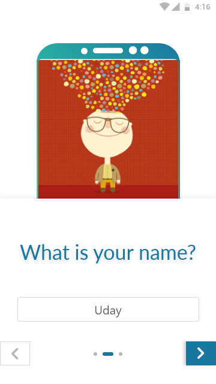

# SELF HELP! (an andriod application)

## Introduction

In 21st century, mental disorder is rising rapidly. According to a survey of Anxiety and Depression Association of America (ADAA), “Anxiety disorders are highly treatable, yet only 36.9% of those suffering receive treatment” and also more than half which are diagnosed with anxiety are also suffering from depression. People who are suffering are afraid to talk to others about their mental disorder.
Hence, to solve this problem we are building an android application “self-help!” which could fill this gap and help them to lead a healthy and peaceful life.

### Download self-help andriod application APK file.
[Download APK](https://selfhelp-app.github.io/apk/self-help.apk) 
OR
[Visit SELF-HELP Website](https://selfhelp-app.github.io)

## Screenshots of Android application

    

## Guideline to try application [If you don't have andriod device]
### Software requirements
1. Download Virtual-box from here https://www.virtualbox.org/wiki/Downloads.
2. Download and installation guidelines for Genymotion: https://docs.genymotion.com/latest/Content/01_Get_Started/Installation.htm

### Genymotion setup for andriod application installation
https://docs.genymotion.com/latest/Content/01_Get_Started/Basic_steps.htm

